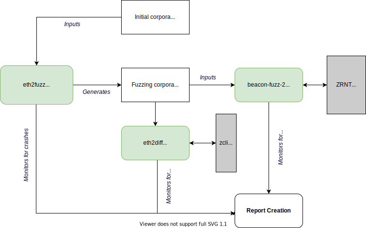

# beacon-fuzz

Open-source fuzzing framework for Ethereum 2.0 (Eth2) Phase0 implementations.
Maintained by Sigma Prime for the Ethereum Foundation.


## Community Fuzzing

For details on our community fuzzing initiative, please refer to the `eth2fuzz` [README](./eth2fuzz/README.md), along with [this blog post](https://blog.sigmaprime.io/beacon-fuzz-06.html).

If you would like to raise any crashes or disclose any bugs identified using this project, please contact us via [email](mailto:security@sigmaprime.io) and use our [PGP key](https://keybase.io/sigp/pgp_keys.asc?fingerprint=15e66d941f697e28f49381f426416dc3f30674b0) to encrypt sensitive messages.

## Overview

This project aims at identifying bugs and vulnerabilities on various Eth2 implementations, by leveraging three different fuzzing tools.

This is a continuation of Guido Vranken's [eth2.0-fuzzing](https://github.com/guidovranken/eth2.0-fuzzing).
This project and its inner workings are subject to change.

_**A note on terminology:** "client" and "implementation" are used interchangeably here to mean a specific Eth2 implementation._


### Architecture overview

The following diagram describes the current architecture of `beacon-fuzz`:



### `eth2fuzz` - Coverage Guided Fuzzer

The purpose of this tool is to identify crashes (i.e. _panics_) in Eth2 implementations. It uses multiple different fuzzing engines (AFL++, HonggFuzz, libFuzzer, etc.). By leveraging explicit code coverage, `eth2fuzz` allows us to flag SSZ containers that are of interest, i.e. those that trigger new code paths.

### `eth2diff` - Replaying Samples Across Implementations

This tool leverages various state transition execution utilities (`ncli`, `zcli`, `lci`, etc.) that replay all samples generated from `eth2fuzz`. We've created dedicated `Docker` containers for each implementation, and one central `Docker` container to orchestrate the execution of `eth2diff`. The goal of this tool is to detect crashes and differences across all supported implementations, for any given set of inputs (`BeaconState` + `BeaconBlock`).


### `beaconfuzz_v2` - Differential Fuzzing with FFI Bindings

A differential fuzzer of Eth2.0 implementations using [libfuzzer](https://llvm.org/docs/LibFuzzer.html) and [honggfuzz](https://github.com/google/honggfuzz).

This tool is the successor of Guido Vranken's [eth2.0-fuzzing](https://github.com/guidovranken/eth2.0-fuzzing) C++ project. It is developed in Rust (for ease of maintainability) and leverages Foreign Function Interfaces (FFI) bindings.

By leveraging the latest update to the `libfuzzer-sys` and `cargo_fuzz` crates, this tool is able to write fuzz targets that take well-formed instances of custom types by deriving and implementing the `Arbitrary` trait, which allows us to create structured inputs from raw byte buffers.

### Implementations

* [Lighthouse](https://github.com/sigp/lighthouse/) (Rust)
* [Lodestar](https://github.com/ChainSafe/lodestar/) (JavaScript)
* [Nimbus](https://github.com/status-im/nimbus-eth2) (Nim)
* [Prysm](https://github.com/prysmaticlabs/prysm) (Go)
* [Teku](https://github.com/PegaSysEng/teku) (Java)


### Operational Fuzz Targets

This project currently focuses on core state transition functions. All fuzzing targets currently use the ["mainnet" config](https://github.com/ethereum/eth2.0-specs/blob/v0.12.2/configs/mainnet.yaml).

* `attestation` - [`process_attestation`](https://github.com/ethereum/eth2.0-specs/blob/v0.12.2/specs/phase0/beacon-chain.md#attestations)
* `attester_slashing` - [`process_attester_slashing`](https://github.com/ethereum/eth2.0-specs/blob/v0.12.2/specs/phase0/beacon-chain.md#attester-slashings)
* `block` - [`state_transition`](https://github.com/ethereum/eth2.0-specs/blob/v0.12.2/specs/phase0/beacon-chain.md#beacon-chain-state-transition-function)
* `block_header` - [`process_block_header`](https://github.com/ethereum/eth2.0-specs/blob/v0.12.2/specs/phase0/beacon-chain.md#block-header)
* `deposit` - [`process_deposit`](https://github.com/ethereum/eth2.0-specs/blob/v0.12.2/specs/phase0/beacon-chain.md#deposits)
* `proposer_slashing` - [`process_proposer_slashing`](https://github.com/ethereum/eth2.0-specs/blob/v0.12.2/specs/phase0/beacon-chain.md#proposer-slashings)
* `voluntary_exit` - [`process_voluntary_exit`](https://github.com/ethereum/eth2.0-specs/blob/v0.12.2/specs/phase0/beacon-chain.md#voluntary-exits)

### Corpora

See [corpora](https://github.com/sigp/beacon-fuzz/tree/master/eth2fuzz/workspace/corpora) for examples and explanation of structure.

## Usage

Please refer to each tool's `README` for detailed instructions:

- `eth2fuzz` [README](./eth2fuzz/README.md)
- `eth2diff` [README](./eth2diff/README.md)
- `beaconfuzz_v2` [README](./beaconfuzz_v2/README.md)

## Progress and Roadmap

- [x] Development of `eth2fuzz`
- [x] Development of `eth2diff`
- [x] Development of `beaconfuzz_v2`
  - [x] Integration of Prysm
  - [x] Integration of Lighthouse
  - [x] Integration of Nimbus
  - [x] Integration of Teku
- [x] Improved onboarding, ease of adding new targets and implementations
- [x] Improved coverage measurements and visibility
- [x] Structure-aware fuzzing mutations in `beaconfuzz_v2`
- [x] Deploy on dedicated production fuzzing infrastructure

The Beacon Fuzz team regularly posts updates on the [Sigma Prime blog](blog.sigmaprime.io/). The latest update is available [here](https://blog.sigmaprime.io/beacon-fuzz-06.html).


## Contributing

Use [pre-commit](https://pre-commit.com/)

```console
$ pre-commit install
```
(see also [.pre-commit-config.yaml](./.pre-commit-config.yaml))

## Trophies

The fuzzing tools developed as part of this project (`eth2fuzz`, `eth2diff` and `beaconfuzz_v2`) helped identify the following bugs inside eth2 clients.

### Nimbus

- [Nimbus: `process_attestation` missing index validation](https://github.com/status-im/nimbus-eth2/issues/659) **fixed**
- [Nimbus **(Consensus Bug)**: `process_deposit` not validating merkle proofs](https://github.com/status-im/nimbus-eth2/issues/703) **fixed**
- [Nimbus: `ncli_pretty` `Deposit` SSZ parsing `AssertionError`](https://github.com/status-im/nimbus-eth2/issues/895) **fixed**
- [Nimbus: `ncli_pretty` Bytes Reader `IndexError` decoding `BeaconState` with empty container](https://github.com/status-im/nimbus-eth2/issues/896) **fixed**
- [Nimbus: `ncli_pretty` Bytes Reader `IndexError` decoding `BeaconState` with variable list reporting 0 length](https://github.com/status-im/nimbus-eth2/issues/920) **fixed**
- [Nimbus: `ncli_transition` out of memory segfault during `process_final_updates`](https://github.com/status-im/nimbus-eth2/issues/921) **fixed**
- [Nimbus: `ncli_transition` `AssertionError` due to inconsistent aggregation bits and committee length when passed *invalid* `BeaconState` and `BeaconBlock`](https://github.com/status-im/nimbus-eth2/issues/922) (See [1](#invalidState)) **fixed**
- [Nimbus: `ncli` `IndexError` decoding 0-byte SSZ BitList](https://github.com/status-im/nimbus-eth2/issues/931) **fixed**
- [Nimbus: `IndexError` during `AttesterSlashing` processing](https://github.com/status-im/nimbus-eth2/issues/1207) **fixed**
- [Nimbus:  Integer Underflow/overflow in `ProposerSlashing` processing](https://github.com/status-im/nimbus-eth2/issues/1323) **fixed** (thanks [@Daft-Wullie](https://github.com/Daft-Wullie) for helping identify this bug!)

### Trinity
- [Trinity: some block validation raising `IndexError`, not caught by `BeaconChainSyncer`](https://github.com/ethereum/trinity/issues/1497)

### Teku
- [Teku: infinite loop when decoding SSZ `BitList` without "end-of-list" marker bit](https://github.com/PegaSysEng/teku/issues/1674) **fixed**
- [Teku: transition subcommand raising `IllegalArgumentException` instead of logging when passed invalid SSZ](https://github.com/PegaSysEng/teku/issues/1675) **fixed**
- [Teku: transition subcommand raising `IllegalArgumentException` instead of logging when passed invalid SSZ](https://github.com/PegaSysEng/teku/issues/1677) **fixed**
- [Teku: `IndexOutOfBoundsException` when SSZ decoding 0-byte `BitList`](https://github.com/PegaSysEng/teku/issues/1678) **fixed**
- [Teku: `IndexOutOfBoundsException` when passed *invalid* `BeaconState` and committee size is inconsistent with attestation aggregation bits](https://github.com/PegaSysEng/teku/issues/1685). (See [1](#invalidState)) **fixed**
- [Teku: `ArrayIndexOutOfBoundsException` in `AttesterSlashing` processing](https://github.com/PegaSysEng/teku/issues/2345) **fixed**
- [Teku: `ProposerSlashing` processing spec deviation](https://github.com/ConsenSys/teku/pull/3151) (_not directly exploitable_) **fixed**

### Lighthouse
- [Lighthouse: out-of-bounds offset in variable list SSZ decoding](https://github.com/sigp/lighthouse/pull/974) **fixed**
- [Lighthouse: multiplication overflow in `compute_proposer_index`](https://github.com/sigp/lighthouse/pull/1009) (See [1](#invalidState)) **fixed**
- [Lighthouse: ENR panic](https://github.com/AgeManning/enr/pull/12) **fixed**
- [Lighthouse: Underflow in Snappy (external dependency)](https://github.com/BurntSushi/rust-snappy/pull/30) **fixed**

### Lodestar
- [Lodestar: `TypeError` when SSZ decoding a `Block` with invalid `BigInt` parent scope](https://github.com/ChainSafe/ssz/issues/22) **fixed**
- [Lodestar: `RangeError` when SSZ decoding an empty `Block` container](https://github.com/ChainSafe/ssz/issues/23)
- [Lodestar: `TypeError` when decoding invalid `ENR` string](https://github.com/ChainSafe/discv5/issues/56) **fixed**
- [Lodestar: `TypeError: public key must be a Buffer` when decoding invalid `ENR` string](https://github.com/ChainSafe/discv5/issues/59) **fixed**
- [Lodestar: memory exhaustion / OOM when parsing invalid `ENR` string](https://github.com/ChainSafe/discv5/issues/64) **fixed** (thanks [@Daft-Wullie](https://github.com/Daft-Wullie) for helping identify this bug!)
- [Lodestar: `AssertionError` in `bcrypto` library when parsing invalid `ENR` string](https://github.com/ChainSafe/discv5/issues/70) **fixed** (thanks [@Buttaa](https://github.com/Buttaa) for helping identify this bug!)
- [Lodestar: Failed assertion `val->IsArrayBufferView` when parsing invalid `ENR` string](https://github.com/ChainSafe/discv5/issues/71) (thanks [@cooganb](https://github.com/cooganb) and [@MysticRyuujin](https://github.com/MysticRyuujin) for helping identify this bug!)

### Prysm
- [Prysm: `panic: runtime error: slice bounds out of range` when parsing SSZ container](https://github.com/prysmaticlabs/prysm/issues/6083) **fixed**
- [Prysm: `panic: runtime error: nil pointer dereference` when processing ProposerSlashing](https://github.com/prysmaticlabs/prysm/issues/6127) **fixed**
- [Prysm **(Consensus Bug)**: Missing validation of attestation indices in batch attestation processing](https://github.com/prysmaticlabs/prysm/pull/6983) **fixed**
- [Prysm: `panic: runtime error: slice bounds out of range` when parsing `SimpleMessage`](https://github.com/prysmaticlabs/prysm/issues/6083#issuecomment-690008952)
- [Prysm: `ProposerSlashing` processing spec deviation](https://github.com/prysmaticlabs/prysm/pull/7252) (_not directly exploitable_) **fixed**
- [Prysm **(Consensus Bug)**: _Off-by-one_ bug in attestation processing](https://github.com/prysmaticlabs/prysm/pull/7684) **fixed**
- [Prysm **(Consensus Bug)**: wrong epoch in proposer slashing validation](https://github.com/prysmaticlabs/prysm/pull/7725) **fixed**

### BLS
- [BLST: Point Decompression does not handle invalid byte lengths](https://github.com/supranational/blst/issues/14) **fixed**
- [BLST: Point Decompression does not enforce field points are less than field modulus](https://github.com/supranational/blst/issues/15) **fixed**


<a name="invalidState">1</a>: **NOTE** `BeaconState` objects are considered trusted inputs (for the moment), so client state transition functions are not expected to handle invalid `BeaconState` values, for now.

## License

MIT - see [LICENSE](./LICENSE)
